# Connect — The AI-Powered Enterprise Communication Platform
Connect is an enterprise communication system redesigned from the ground up with Artificial Intelligence at its core.  
It goes beyond basic messaging by integrating automation, real-time insights, and context-aware AI tools to enhance productivity for both administrators and employees.
---

# 🌟 Why Connect is Different
Traditional chat apps only help users *send messages*.  
**Connect helps users *think*, *organize*, and *act* with built-in intelligent automation.**

- Automates user onboarding  
- Summarizes long chats or documents  
- Generates contextual , similar tone and style replies  
- Provides structured Playbooks from chats  
- Helps employees with queries directly in chat  
---

# 🧠 Intelligent Features for Administrators

## **AI Onboarding**
Instead of manually creating accounts, the admin can provide a list of new hires to the AI webhook.  
The AI system will automatically:  
✔ Process and validate the data  
✔ Create user accounts  
✔ Generate secure temporary passwords  
✔ Send automatic welcome emails  

### **Admin Panel Overview**
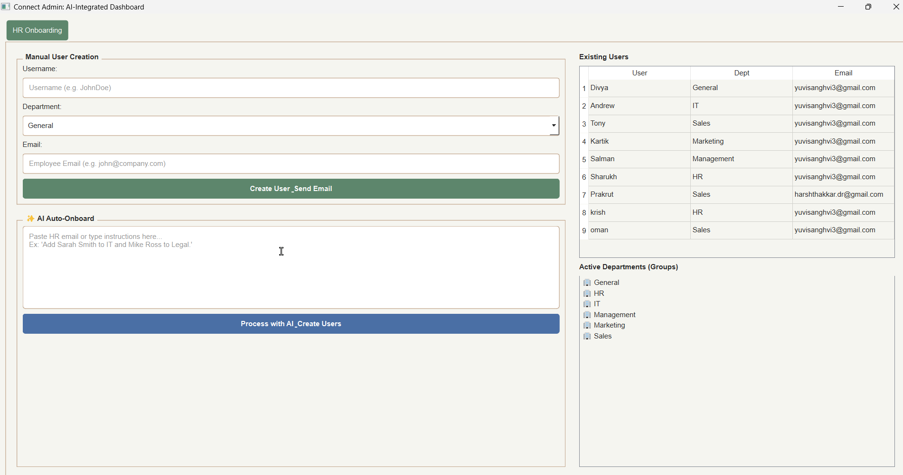

### **AI Onboarding (Manual Entry)**

### **AI-Onboard**

### **Generated Welcome Email**
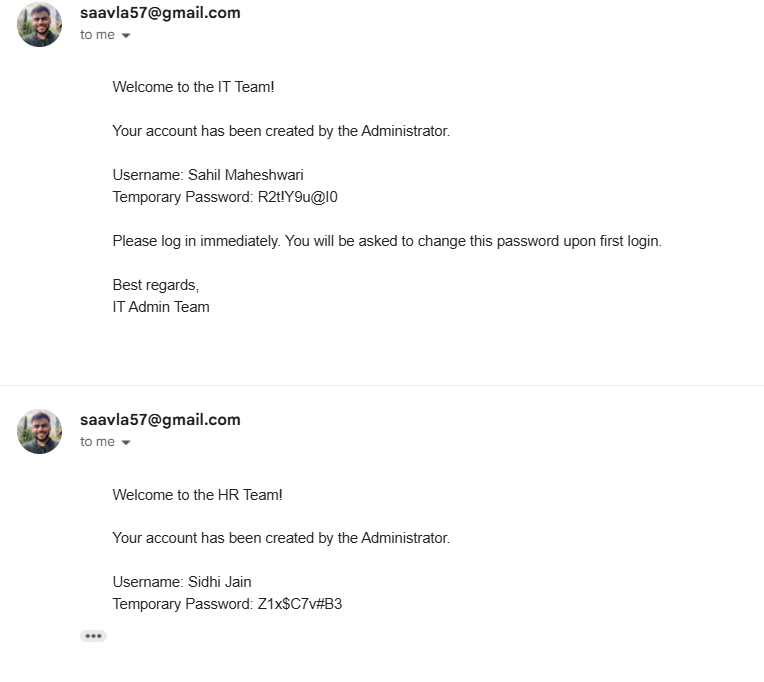

### **System Display Board**

---

# 🔐 Secure Login Process

### Steps:
1. **User receives temporary credentials via email**
2. **Enters temporary password**
3. **Forced password change**
4. **App restarts with new credentials**

### **Temporary Password Prompt**
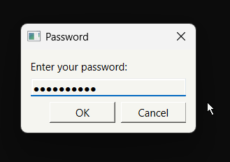

### **Forced Password Change**
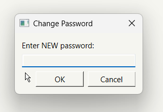

### **Restart After Password Update**
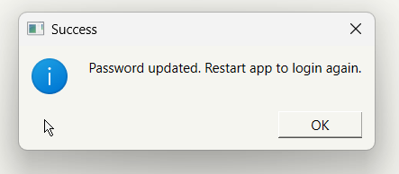

---

# 💻 Connect GUI Walkthrough  
Connect’s interface is divided into intuitive sections.

## **📌 Full GUI Overview**
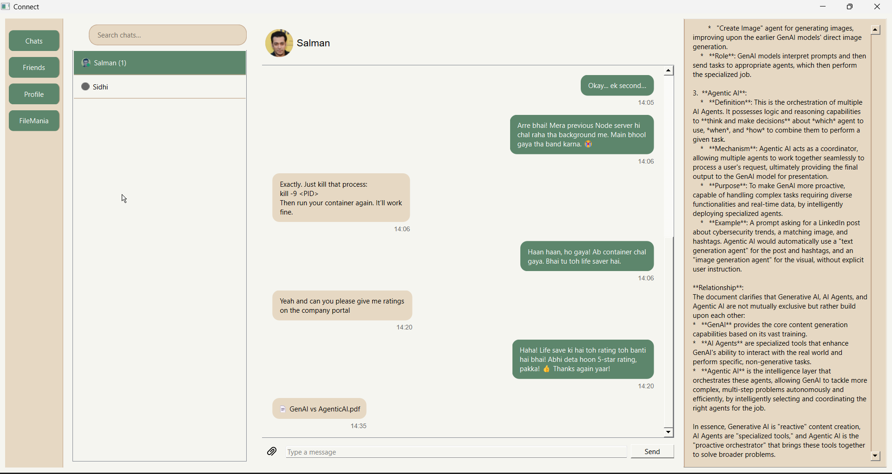
---

# 👤 Profile Section  
Users can view and update their personal information.

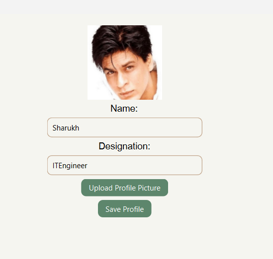

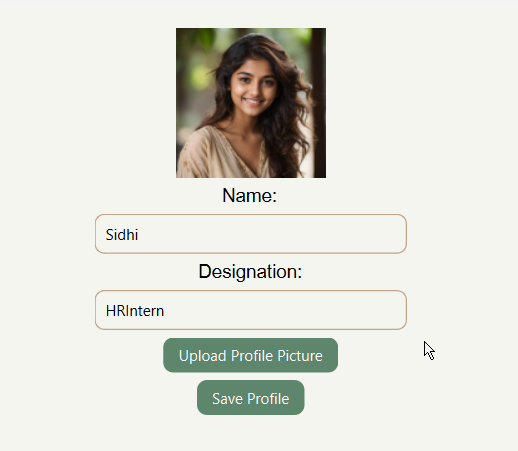

---

# 🤝 Friends Section  
Manage colleague connections with 3 views:

### **Pending Requests**
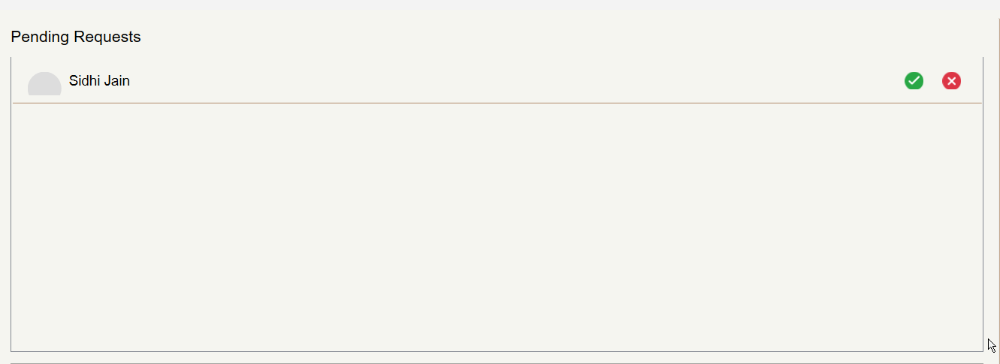

### **My Friends**
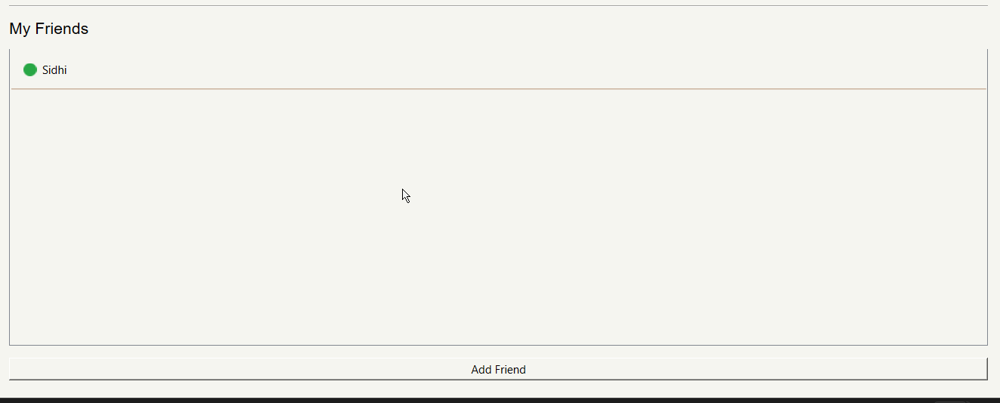

### **Add Friend**

---

# 💬 Chat Section  
Real-time messaging with advanced features:  
✔ Online/offline indicator  
✔ Search messages  
✔ Unread messages  
✔ File sharing with preview  

### **Search Feature**
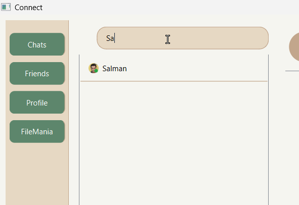

### **Chat Window**
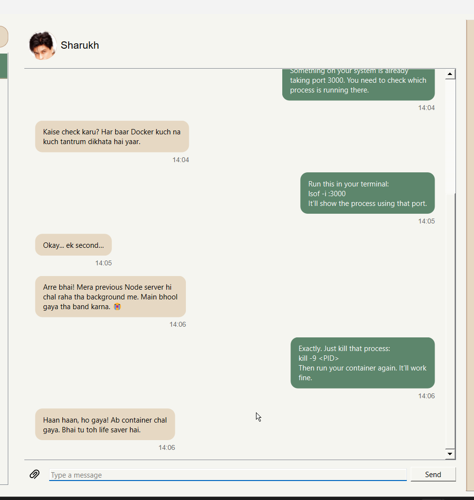

### **Send File**
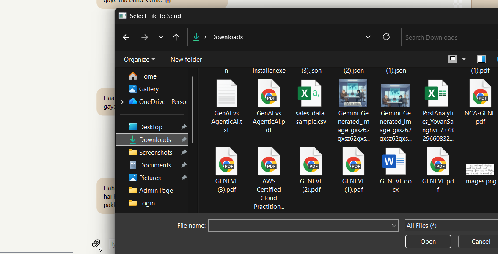

### **File Preview in Chat**
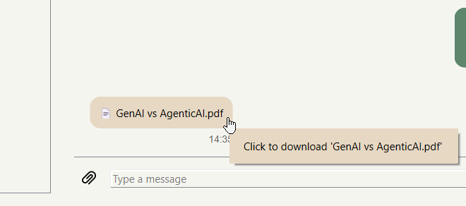

### **Receive File**
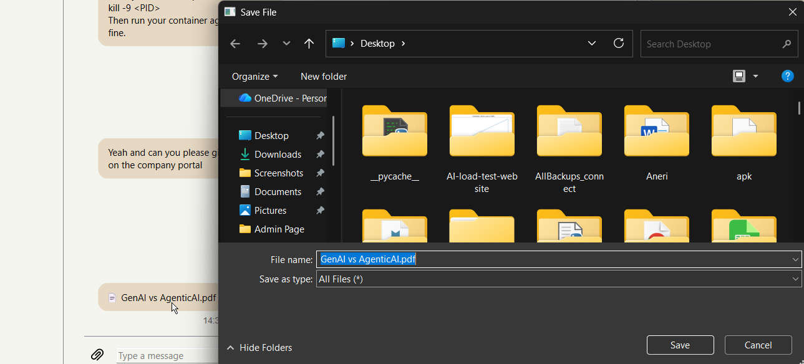

### **Unread Message Indicator**
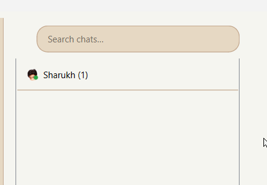

---

# 🤖 AI Tools (AutoAI, Playbook, Summarize, Helper)

Connect integrates several AI assistants within chat.

## **AutoAI**
Suggests responses or tasks based on message context.

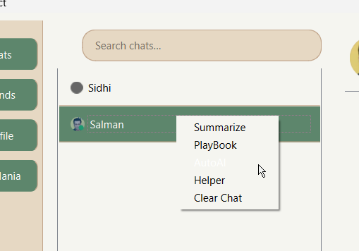

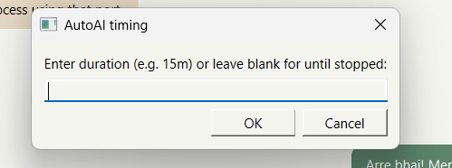

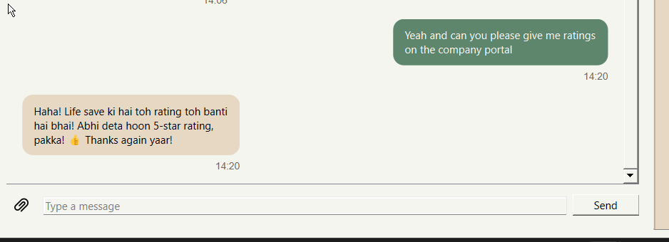

---

## **Playbook**
Provides guided patterns, structured actions, or predefined workflows.

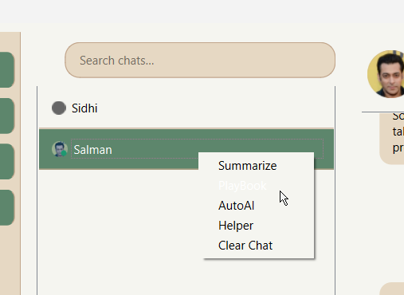

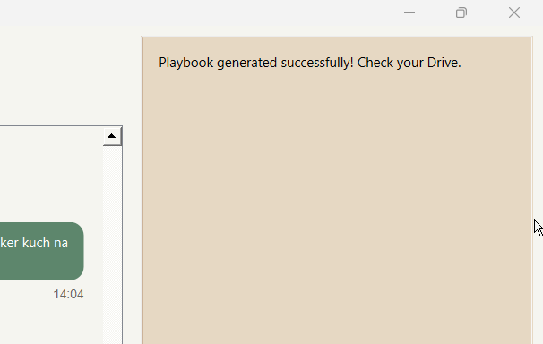

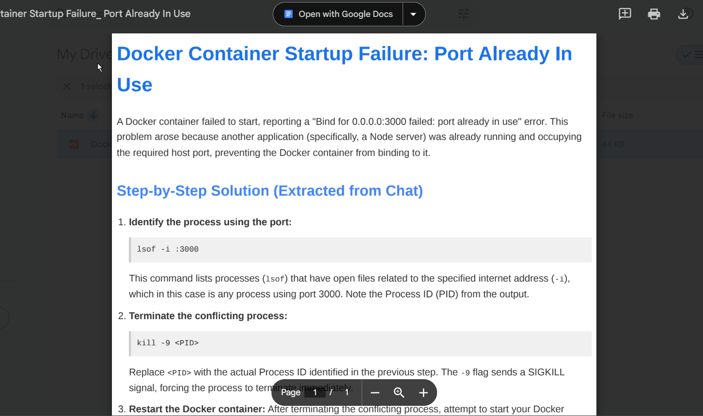

---

## **Summarize**
Provides summary of the whole chat thread with key points.

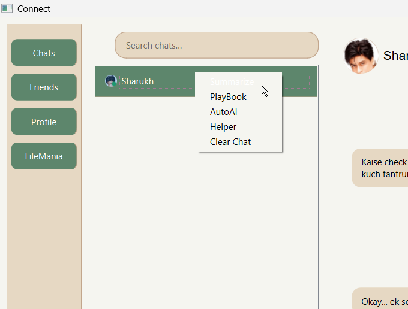

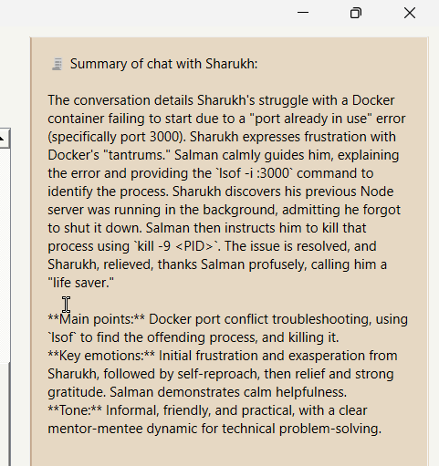

## **Helper**
Ask direct questions — get instant answers.

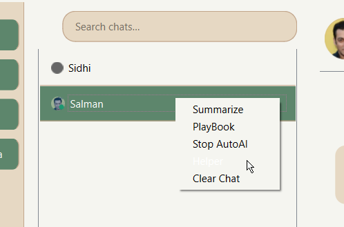

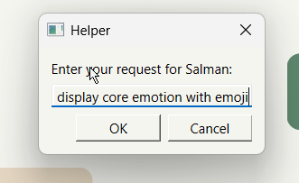

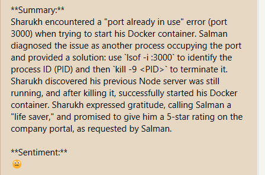

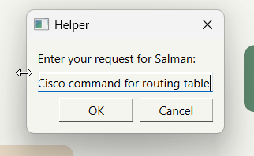

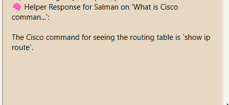

---

# 📁 FileMania — AI File Processing  

Upload a file and ask the AI to:
- Summarize  
- Generate a report  
- Extract key points  

### **File Dropped**
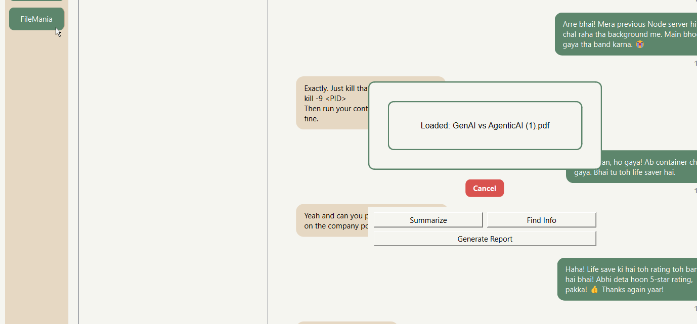

### **Report Generation**
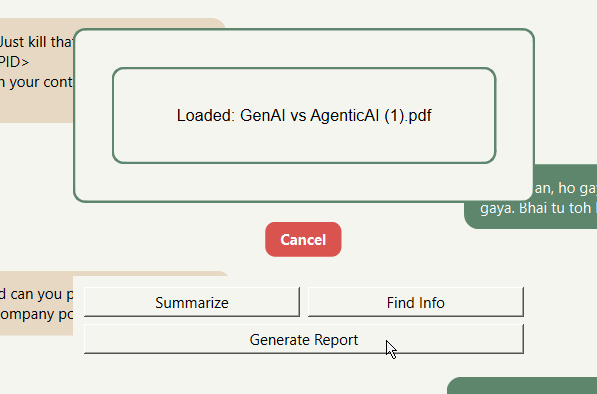

### **Report Output**
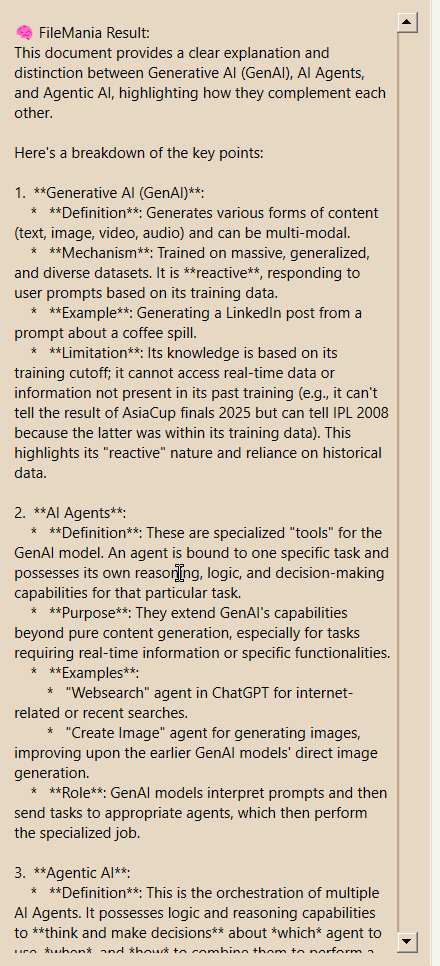

### **Summarize Click**
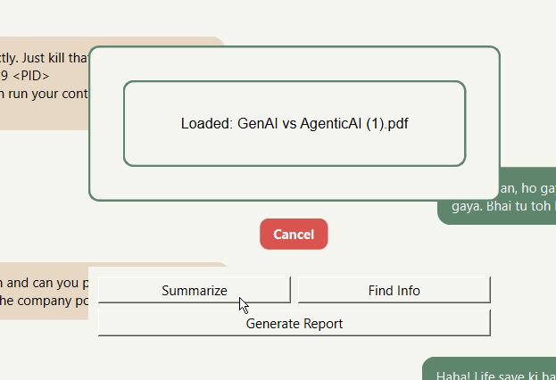

### **Summarize Output**
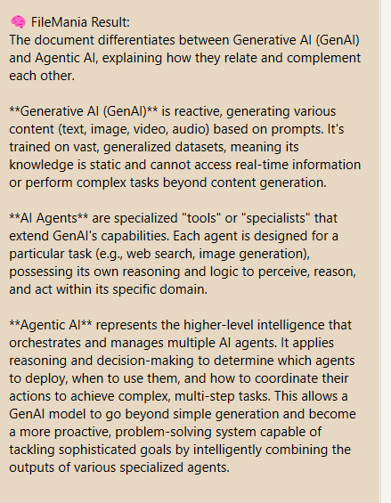

---

# 🔒 Security & Protocol
Connect uses **TLS/SSL encryption** for client-server communication ensuring:  
- All messages remain private  
- File transfers are secure  
- Login credentials are encrypted in transit  
---

# 🗂 Data Persistence  
Connect securely stores:  
- User accounts  
- Friend lists  
- Chat history  
- File metadata  

This ensures data remains intact even if the system restarts.
---

